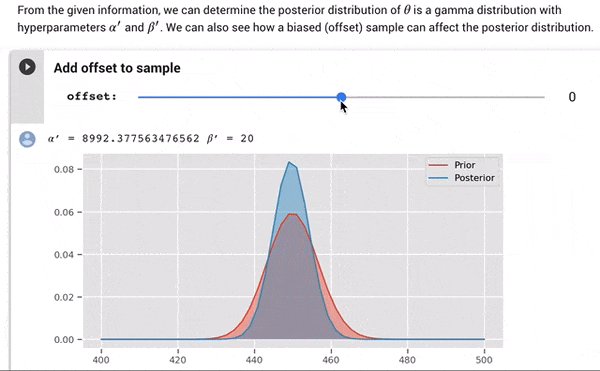

# Prob&Stats with TensorFlow Probability

  

This project is conceptualised to supplement ISTD [50.034 (Introduction to Probability and Statistics)](https://istd.sutd.edu.sg/undergraduate/courses/50034-introduction-to-probability-and-statistics) with some nice visualisations and code things to play with. It does not, and is not intended to, cover all the subject areas of 50.034.

This repository contains [**Jupyter Notebooks**](https://jupyter.org/) that are designed to run on [**Google Colaboratory**](https://colab.research.google.com/), a free Jupyter environment that runs in the cloud. This means that there's nothing to install on your computer!

Most of the code here will utilise the [**TensorFlow Probability**](https://www.tensorflow.org/probability) library. If you're viewing the Notebook on Colab, there's nothing you have to worry about since everything you need is already configured.

## Contents

| S/N | Notebook Title                       | Link |
| --- | ------------------------------------ | ---- |
| 01  | Introduction and Normal Distribution | [](https://colab.research.google.com/github/OpenSUTD/ProbStats-with-TFP/blob/master/01_Intro_Normal_Distributions.ipynb)  |
| 02  | Special Distributions                | [](https://colab.research.google.com/github/OpenSUTD/ProbStats-with-TFP/blob/master/02_Special_Distributions.ipynb)|
| 03  | Bayesian Approach to Coin-flip       | [](https://colab.research.google.com/github/OpenSUTD/ProbStats-with-TFP/blob/master/03_Bayesian_Coin_Flip.ipynb)|
| 04  | Sampling from Distributions          | [](https://colab.research.google.com/github/OpenSUTD/ProbStats-with-TFP/blob/master/04_Sampling_Distributions.ipynb)|
| 05  | CLT and Approximating Distributions  | [](https://colab.research.google.com/github/OpenSUTD/ProbStats-with-TFP/blob/master/05_CLT_Approximations.ipynb)|
| 06  | WIP                                  | WIP|

Do note that you'll get Colab's usual warning about running an untrusted notebook. That is expected behavior for opening a third-party notebook on Colab. Just click past that.

**What's in the Notebooks**

Most of the notebooks contain concise explanations of key concepts, as well as visualisations. You will be able to interact with the visualisations using sliders to see the effect of varying parameters.



**Local Install**

If you want to run the notebooks locally (not recommended if you don't already have a TensorFlow environment set up):

```bash
git clone https://github.com/OpenSUTD/ProbStats-with-TFP
cd ProbStats-with-TFP

# install dependencies
pip install tensorflow
pip install -r requirements.txt

# run Jupyter Notebook (or JupyterLab)
jupyter notebook
```

## Contributing

Any relevant contributions are welcome! Feel free to open a pull request. 

**How To Contribute**

You can fork this repository into your own GitHub account, then clone it into your Google Drive folder on your local computer. This way, you'll be able to push commits to your own fork, and submit a Pull Request to this repository.

**Simple Requirements**

1. Only use "common" libraries
2. Design to run on Google Colaboratory
3. Make an effort to keep code simple and understandable

**Core Maintainer**

Timothy Liu / [@tlkh](https://github.com/tlkh)
